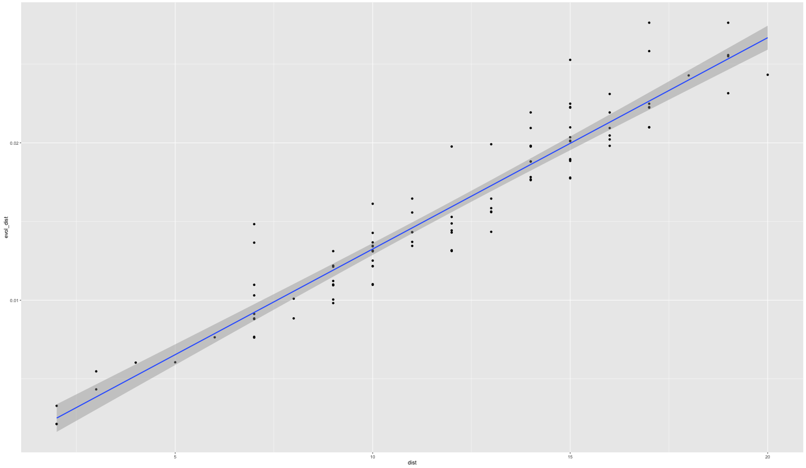
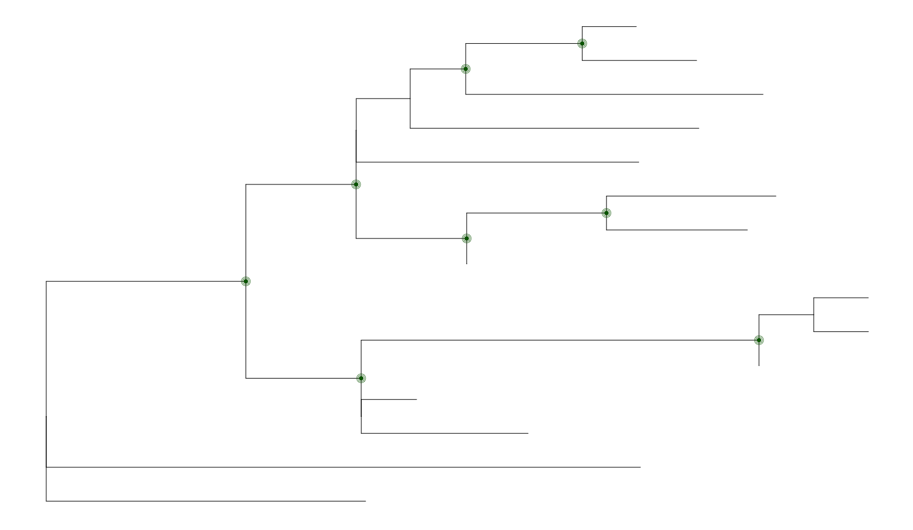

# `harrietr`: An `R` package for various phylogenetic and evolutionary biology data manipulations 

[](https://travis-ci.org/andersgs/harrietr)
[](https://cran.r-project.org/package=harrietr)

## Why `harrietr`:

Harriet is believed to be Charles Darwin's pet 
[giant turtle](https://en.wikipedia.org/wiki/Harriet_(tortoise)). It is thought
that Harriet spent the latter part of her life at in 
Brisbane, Australia. Thus, Harriet satisfies the three criteria to name this 
package: (1) it is somehow evolutionarily related; (2) it has an Australian
connection; and (3) it avoids the prefix `phylo` used by many `R` evolutionarily-
relavant packages. The appended `r` just helps differentiate to make it easier to
search in Google, and aludes to the fact that it is related to the programming
language `R`.

## How to get it

### From CRAN:

1. Add `Bioconductor` to your list of default repositories:

    `setRepositories(ind = 1:2)`

2. Install `harrietr`:
    
    `install.packages("harrietr", dependencies = TRUE)`


### Latest and gratest version from GitHub:

You must use `devtools`:

1. If you don't have `devtools` installed:

    `install.packages('devtools')`

2. Add `Bioconductor` to your list of default repositories:

    `setRepositories(ind = 1:2)`

3. Install `harrietr`:

    `devtools::install_github("andersgs/harrietr@v0.2.2")`

## How to use it

Three functions are provided at this time:

`dist_long` --- This function takes as input an alignment in `DNA.bin` format
calculates all the pairwise distances, and returns all the unique pairwise distances
as a `data.frame` in a long format. For example, in the case of three samples:

id1      |id2     |distance
-------- |--------|--------
sample1  |sample2 |dist_12
sample1  |sample3 |dist_13
sample2  |sample3 |dist_23
  
You can give `dist_long` a tree (object of class `phylo`), and it will add a 
fourth column with the pairwise distance obtained from the tree:

id1      |id2     |distance | evol_dist
-------- |--------|---------|----------
sample1  |sample2 |dist_12  |evol_dist_12
sample1  |sample3 |dist_13  |evol_dist_13
sample2  |sample3 |dist_23  |evol_dist_23

`melt_dist` --- This function is used by `dist_long`, but it takes as input a
distance matrix. This might be useful if you alredy have a distance matrix that
is imported into `R`.

`get_node_support` --- This function is written to work with trees generated by 
[IQTREE](http://www.iqtree.org/). In particular, if the tree was generated when
calculating node support by both ultrafast bootstrap and SH approximate likelihood
ratio test, IQTREE writes the support as the node label in the Newick file in the
following format: `"SH-aLRT/uBS"`. In other words, it is a string with two values
separated by a `slash`. The first value is the `SH-aLRT` support (as a percentage)
and the second value is the ultrafast bootstrap support (also as a percentage).

The output is a `data.frame` with each row representing an internal node, with
information that can be used to plot support information layers on a tree.

## Some use cases

1. [Comparing distances](#comparing_distances)
2. [Plotting node support](#node_support)
3. [Getting group level stats](#group_stats)


<a name="comparing_distances"/>

### Comparing distances
Assume you have a tree, and you want to understand what is the relationship
between the branch lengths and the number of SNPs. The function `dist_long` 
can help you get there:

```
library(harrietr)
library(ggplot2)
data("woodmouse")
data("woodmouse_iqtree")
dist_df <- dist_long(aln = woodmouse, order = woodmouse_iqtree$tip.label, dist = "N", tree = woodmouse_iqtree)
ggplot(dist_df, aes(x = dist, y =  evol_dist)) + 
  geom_point() + stat_smooth(method = 'lm') +
  ylab("Evolutionary distance") +
  xlab("SNP distance")
```

This will produce the following image:



<a name="node_support"/>

### Indicating nodes that have support on a tree
Assume you have generated your ML tree with IQTREE, and wish to plot it in `R`, 
and indicate which nodes have 50% or more support values for both metrics (**note**: 
the value of 50% is likely too low, these values are chosen only for illustration
purposes). The function `get_node_support` can help
you get there:

```
library(ggtree)
library(dplyr)
library(harrietr)
data("woodmouse_iqtree")
p1 <- ggtree(woodmouse_iqtree)
node_support <- get_node_support(woodmouse_iqtree)
p1 + 
  geom_point(data = node_support %>% dplyr::filter(`SH-aLRT` >= 50 & uBS >= 50), aes(x = x, y = y), colour = 'darkgreen', size = 3) +
  geom_point(data = node_support %>% dplyr::filter(`SH-aLRT` >= 50 & uBS >= 50), aes(x = x, y = y), colour = 'darkgreen', size = 5, pch = 21) +
  geom_point(data = node_support %>% dplyr::filter(`SH-aLRT` >= 50 & uBS >= 50), aes(x = x, y = y), colour = 'darkgreen', size = 7, pch = 21)
```

This will produce the following image:



<a name="group_stats"/>

### Getting group level statistics
Assume you have classified your samples into different groups (say A, B, and C). 
These could be anything (e.g., MLST, sample source, host, etc.), and you want 
summary information among and between the groups (e.g., IQR, min/max dist). 
You can use `dist_long` and `add_metadata` to generate the `data.frame` you need:

```
library(ggplot2)
library(dplyr)
library(harrietr)
data("woodmouse")
data("woodmouse_iqtree")
data("woodmouse_meta")
dist_df <- dist_long(aln = woodmouse, order = woodmouse_iqtree$tip.label, dist = "N", tree = woodmouse_iqtree)
dist_df <- add_metadata(dist_df, woodmouse_meta, isolate = 'SAMPLE_ID', group = 'CLUSTER', remove_ind = TRUE)
dist_df %>%
  dplyr::group_by(CLUSTER) %>%
  dplyr::summarise(q50 = median(dist),
  q25 = quantile(dist, prob = c(0.25)),
  q75 = quantile(dist, prob = c(0.75)),
  min_dist = min(dist),
  max_dist = max(dist)) %>%
  ggplot( aes( x = CLUSTER, y = q50)) +
  geom_errorbar( aes(ymin = q25, ymax = q75),width = 0.25 ) +
  geom_point(size = 3, colour = 'darkred') +
  geom_point( aes( y = min_dist), colour = 'darkgreen', size = 3) +
  geom_point( aes( y = max_dist), colour = 'darkgreen', size = 3) +
  ylab("Pairwise SNP difference") +
  xlab("Groups")
```
This will produce the following image:


